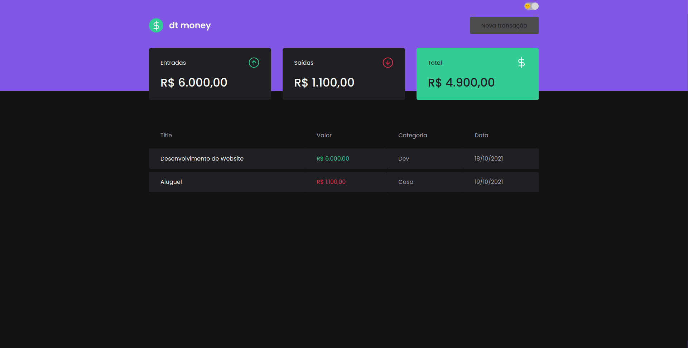
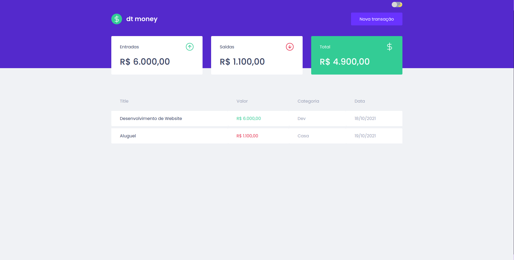

# DtMoney

    
  

## Tópicos

[Sobre o DtMoney](#sobre-o-dtmoeny)

[Tecnologias](#tecnologias)

[Licença](#licença)

 

## Sobre o DtMoney

O DtMoney é um App que criado com a finalidade de gerenciar gastos financeiros. Desenvolvido na trilha ignite chapter II da [Rocketseat](https://rocketseat.com.br/).

 

## Dark Mode

  
   

## Light Mode

  
   

 

## Layout

- [figma](https://www.figma.com/file/19BlggIxyiJiasqdhNZBRH/dtmoney-augusto)

## Tecnologias

Tecnologias e ferramentas utilizadas no desenvolvimento do projeto:

- [React](https://reactjs.org/)
- [TypeScript](https://www.typescriptlang.org/)
- [axios](https://github.com/axios/axios)
- [styled-component](https://styled-components.com/)
- [miragejs](https://miragejs.com/)
- [polished](https://polished.js.org/)
- [VS Code](https://code.visualstudio.com/) com [ESLint](https://eslint.org/), [Prettier](https://prettier.io/) e [EditorConfig](https://editorconfig.org/)

 

## Licença

 

Esse projeto está sob a licença MIT. Veja o arquivo [LICENSE](/LICENSE) para mais detalhes.

---

Feito com :purple_heart: by [Augusto Monteiro](https://github.com/augustojaml)

