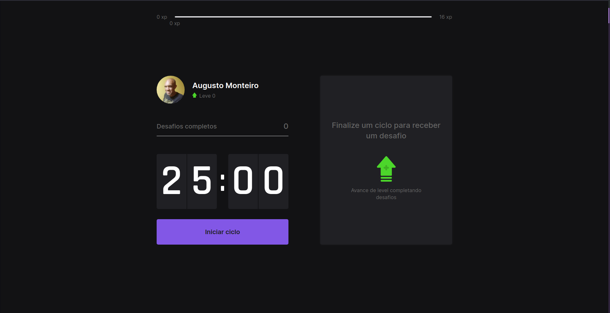

# Moveit

    
  

## Tópicos

[Sobre o Move.it](#sobre-o-moveit)

[Tecnologias](#tecnologias)

[Instalação e uso](#instalação-e-uso)

[Licença](#licença)

 

## Sobre o Move.it

O Move.it é um App que utiliza a técnica de [pomodoro](https://pt.wikipedia.org/wiki/T%C3%A9cnica_pomodoro), com o objetivo de melhorar sua produtividade e foco. Desenvolvido durante a Next Level Week #4 da [Rocketseat](https://rocketseat.com.br/).

 

  
   

GI
 

  

## Tecnologias

Tecnologias e ferramentas utilizadas no desenvolvimento do projeto:

- [React](https://reactjs.org/)
- [Next.js](https://nextjs.org/)
- [TypeScript](https://www.typescriptlang.org/)
- [JavaScript Cookie](https://github.com/js-cookie/js-cookie)
- [Styled Components](https://styled-components.com/)
- [React Icons](https://react-icons.github.io/react-icons/)
- [VS Code](https://code.visualstudio.com/) com [ESLint](https://eslint.org/), [Prettier](https://prettier.io/) e [EditorConfig](https://editorconfig.org/)

 

## Licença

 

Esse projeto está sob a licença MIT. Veja o arquivo [LICENSE](/LICENSE) para mais detalhes.

---

Feito com :purple_heart: by [Rafael Martins](https://github.com/martins-rafael)

