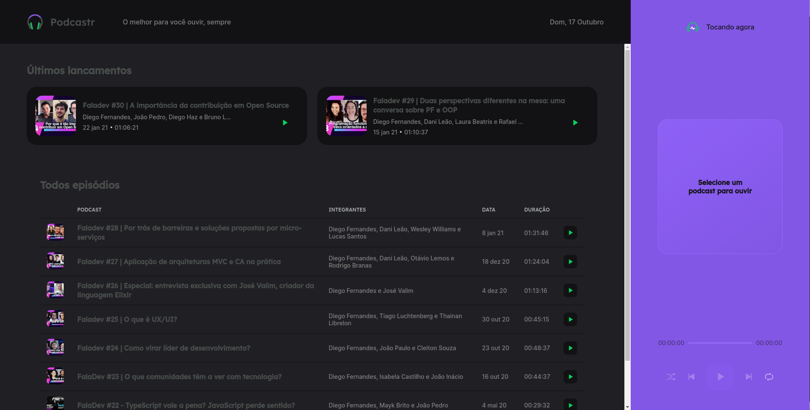

# Podcastr

    
  

## Tópicos

[Sobre o Podcastr](#sobre-o-podcastr)

[Tecnologias](#tecnologias)

[Licença](#licença)

 

## Sobre o Podcastr

O Podcastr é um App que criado com a finalidade de ouvir podcast. Desenvolvido durante a Next Level Week #5 da [Rocketseat](https://rocketseat.com.br/).

 

  
   

 

## Tecnologias

Tecnologias e ferramentas utilizadas no desenvolvimento do projeto:

- [React](https://reactjs.org/)
- [Next.js](https://nextjs.org/)
- [TypeScript](https://www.typescriptlang.org/)
- [JavaScript Cookie](https://github.com/js-cookie/js-cookie)
- [date-fns](https://date-fns.org)
- [axios](https://github.com/axios/axios)
- [sass](https://sass-lang.com/)
- [rc-slider](https://github.com/schrodinger/rc-slider)
- [VS Code](https://code.visualstudio.com/) com [ESLint](https://eslint.org/), [Prettier](https://prettier.io/) e [EditorConfig](https://editorconfig.org/)

 

## Licença

 

Esse projeto está sob a licença MIT. Veja o arquivo [LICENSE](/LICENSE) para mais detalhes.

---

Feito com :purple_heart: by [Augusto Monteiro](https://github.com/augustojaml)

